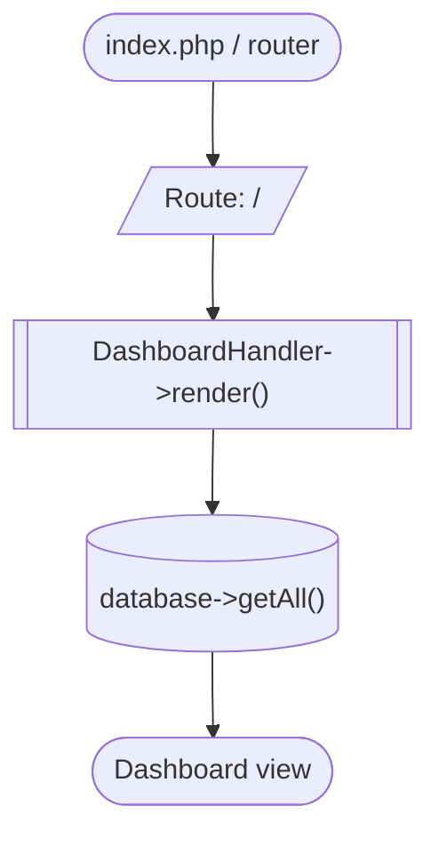
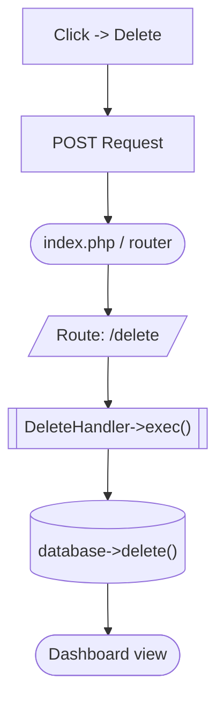
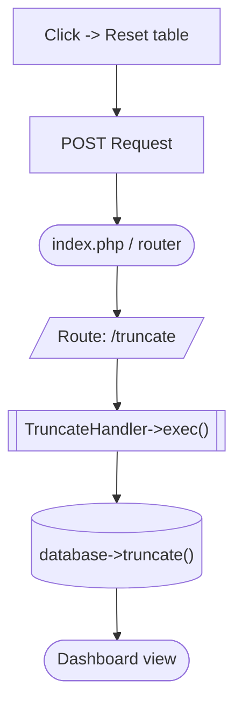
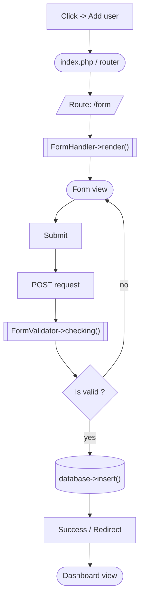
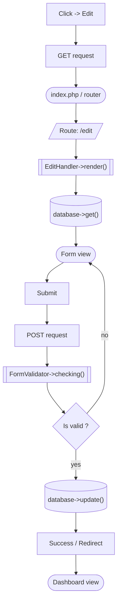

# CRUD flow

- [Dashboard](#dashboard)
    - [Display users](#display-users)
    - [Delete user](#delete-user)
    - [Truncate table](#truncate-table)
- [Form](#form)
    - [Create user](#create-user)
    - [Update user](#update-user)

---

## Dashboard

### Display users

### Delete user

### Truncate table

## Form

### Create user

### Edit user

---

[README](../README.md)
